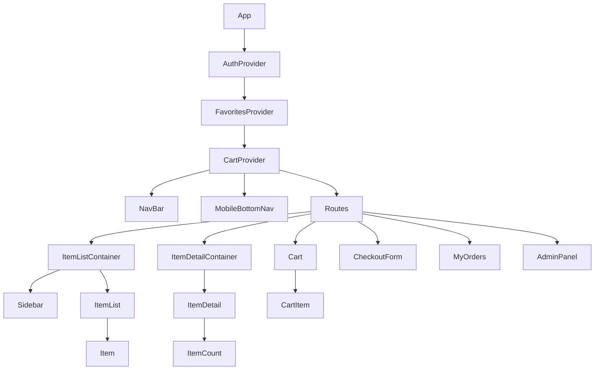

# 🛒 CoderStore - E-Commerce Tecnológico


---

## 📄 Portada y Ficha Técnica del Proyecto

* **Nombre de la Aplicación:** CoderStore - E-Commerce Tecnológico
* **Propósito:** Proyecto Final Evaluativo para la certificación en React JS.
* **Institución:** Coderhouse
* **Curso:** React JS
* **Comisión:** #95090
* **Estudiante / Desarrollador:** Nicolás Vergara (`NVproductions`)
* **Repositorio GitHub:** [https://github.com/vqn2410/Curso-React-JS-Coder](https://github.com/vqn2410/Curso-React-JS-Coder)
* **Fecha de Finalización:** 2026

---

## 📌 Descripción General del E-Commerce

**CoderStore** es una plataforma de comercio electrónico de tipo **Single Page Application (SPA)** especializada en la venta de productos tecnológicos de alta gama (Celulares, Laptops y Tablets). La aplicación ha sido desarrollada desde cero integrando las mejores prácticas de **React JS**, enrutamiento dinámico, manejo de estado global centralizado mediante **Context API** y almacenamiento en tiempo real con **Firebase Firestore** y **Firebase Authentication**.

### 🌟 Propuesta de Valor y Funcionalidades Clave
1. **Catálogo Dinámico y Filtrado Avanzado:**
   * Carga de productos en tiempo real desde Firestore.
   * Navegación por categorías mediante rutas dinamizadas (`/category/:categoryId`).
   * Panel lateral interactivo (**Sidebar**) con filtrado en tiempo real por rango de precios y ordenamiento sin peticiones innecesarias a la base de datos.
2. **Ficha de Detalle de Producto:**
   * Vista individual por producto (`/item/:itemId`) con selector interactivo de cantidad (`ItemCount`) que respeta estrictamente el stock disponible.
3. **Carrito de Compras Persistente & Wishlist:**
   * Gestión completa de carrito vía `CartContext`: añadir, eliminar items, modificar cantidades y calcular precio total e items consolidados en el `CartWidget`.
   * Sistema de Favoritos (`FavoritesContext`) para marcar productos preferidos.
4. **Sistema de Autenticación de Usuarios:**
   * Registro e Inicio de Sesión integrados con **Firebase Auth** (`AuthContext`), permitiendo guardar los datos del comprador y auto-completar los formularios de checkout.
5. **Checkout Transaccional con Descuento Atómico de Stock:**
   * Formulario de compra completo con soporte para múltiples métodos de pago (Efectivo y Tarjeta de Crédito en cuotas con formateo dinámico).
   * **Verificación y actualización de stock atómica mediante `writeBatch` de Firestore**, impidiendo la venta de productos sin stock y garantizando consistencia.
   * Generación de comprobante con ID único de orden.
6. **Historial de Compras & Panel de Administración:**
   * Vista de cliente (`/mis-compras`) para rastrear pedidos históricos mediante email.
   * Vista de administración (`/admin`) para consultar la totalidad de ventas registradas.
7. **Diseño Responsivo & Experiencia de Usuario (UX/UI):**
   * Estilizado profesional con Bootstrap 5, tarjetas con elevación visual, alertas informativas, animaciones suaves de carga y una barra de navegación inferior móvil (`MobileBottomNav`).

---

## 🛠️ Implementación Técnica y Evidencia por Rúbrica

A continuación se detalla la correspondencia entre la rúbrica de evaluación y la arquitectura implementada en el código fuente:

### 1. 🏗️ Arquitectura y Estructura del Proyecto
* **Herramientas de Construcción:** Inicializado con **Vite** para desarrollo ultra rápido y empaquetado optimizado.
* **Componentización Modular:** Organización limpia basada en componentes contenedores y presentacionales dentro de la carpeta [`src/components`](file:///Users/nico/Desktop/coder/src/components).

### 2. 🗺️ Enrutamiento y Navegación (`React Router DOM`)
La navegación de la aplicación es administrada centralmente en [`src/App.jsx`](file:///Users/nico/Desktop/coder/src/App.jsx).

| Ruta | Componente Asociado | Archivo de Origen | Descripción / Propósito |
| :--- | :--- | :--- | :--- |
| `/` | `<ItemListContainer />` | [`ItemListContainer.jsx`](file:///Users/nico/Desktop/coder/src/components/ItemListContainer/ItemListContainer.jsx) | Catálogo general de productos |
| `/category/:categoryId` | `<ItemListContainer />` | [`ItemListContainer.jsx`](file:///Users/nico/Desktop/coder/src/components/ItemListContainer/ItemListContainer.jsx) | Catálogo filtrado por categoría (celulares, laptops, tablets) |
| `/item/:itemId` | `<ItemDetailContainer />` | [`ItemDetailContainer.jsx`](file:///Users/nico/Desktop/coder/src/components/ItemDetailContainer/ItemDetailContainer.jsx) | Vista detallada del producto seleccionado |
| `/cart` | `<Cart />` | [`Cart.jsx`](file:///Users/nico/Desktop/coder/src/components/Cart/Cart.jsx) | Vista resumida del carrito con desglose de precios |
| `/checkout` | `<CheckoutForm />` | [`CheckoutForm.jsx`](file:///Users/nico/Desktop/coder/src/components/CheckoutForm/CheckoutForm.jsx) | Formulario de datos, validación y confirmación de orden |
| `/mis-compras` | `<MyOrders />` | [`MyOrders.jsx`](file:///Users/nico/Desktop/coder/src/components/MyOrders/MyOrders.jsx) | Consulta de órdenes por email o usuario autenticado |
| `/admin` | `<AdminPanel />` | [`AdminPanel.jsx`](file:///Users/nico/Desktop/coder/src/components/Admin/AdminPanel.jsx) | Panel global de ventas y compras registradas |
| `/favoritos` | `<Favorites />` | [`Favorites.jsx`](file:///Users/nico/Desktop/coder/src/components/Favorites/Favorites.jsx) | Listado de productos guardados por el usuario |
| `/registro` | `<Register />` | [`Register.jsx`](file:///Users/nico/Desktop/coder/src/components/Auth/Register.jsx) | Formulario de registro de usuario |
| `/login` | `<Login />` | [`Login.jsx`](file:///Users/nico/Desktop/coder/src/components/Auth/Login.jsx) | Formulario de inicio de sesión |
| `*` | `404 NOT FOUND` | [`App.jsx`](file:///Users/nico/Desktop/coder/src/App.jsx) | Vista de rescate para rutas inexistentes |

### 3. 🧩 Patrón de Componentes (Contenedor vs Presentacional)
* **Componentes Contenedores (Lógica y Fetching):**
  * [`ItemListContainer.jsx`](file:///Users/nico/Desktop/coder/src/components/ItemListContainer/ItemListContainer.jsx): Realiza las peticiones a Firestore (`getDocs`, `query`, `where`), gestiona estados de carga (`loading`) y aplican filtros de precios.
  * [`ItemDetailContainer.jsx`](file:///Users/nico/Desktop/coder/src/components/ItemDetailContainer/ItemDetailContainer.jsx): Consulta un documento específico en Firestore (`getDoc`) usando `useParams`.
* **Componentes Presentacionales (Interfaz de Usuario):**
  * [`ItemList.jsx`](file:///Users/nico/Desktop/coder/src/components/ItemListContainer/ItemList.jsx) & [`Item.jsx`](file:///Users/nico/Desktop/coder/src/components/ItemListContainer/Item.jsx): Muestra las tarjetas con imagen, precio, insignia de categoría y botón de detalle.
  * [`ItemDetail.jsx`](file:///Users/nico/Desktop/coder/src/components/ItemDetailContainer/ItemDetail.jsx): Muestra la descripción, precio, imagen y renderiza el `<ItemCount />`.
  * [`ItemCount.jsx`](file:///Users/nico/Desktop/coder/src/components/ItemDetailContainer/ItemCount.jsx): Selector con controles `+` y `-` validando límites entre `1` y el `stock` disponible.
  * [`NavBar.jsx`](file:///Users/nico/Desktop/coder/src/components/NavBar/NavBar.jsx) & [`CartWidget.jsx`](file:///Users/nico/Desktop/coder/src/components/NavBar/CartWidget.jsx): Barra superior con contador reactivo de ítems en carrito.



### 4. ⚡ Manejo de Estado Global (Context API)
La aplicación hace uso de tres contextos en cápsula para evitar la propagación innecesaria de props (*prop drilling*):

1. **[`CartContext.jsx`](file:///Users/nico/Desktop/coder/src/context/CartContext.jsx):**
   * `cart`: Array de objetos añadidos.
   * `addItem(item, quantity)`: Agrega o incrementa la cantidad de un producto.
   * `removeItem(itemId)`: Elimina un producto individual.
   * `clearCart()`: Vacía el carrito por completo.
   * `isInCart(itemId)`: Verificación booleana.
   * `totalQuantity` & `total`: Valores calculados dinámicamente.
2. **[`AuthContext.jsx`](file:///Users/nico/Desktop/coder/src/context/AuthContext.jsx):**
   * Control de estado de sesión de Firebase (`onAuthStateChanged`).
   * Funciones `login(email, password)`, `register(email, password, userData)` y `logout()`.
3. **[`FavoritesContext.jsx`](file:///Users/nico/Desktop/coder/src/context/FavoritesContext.jsx):**
   * Almacenamiento y alternancia de wishlist con `toggleFavorite(item)` e `isFavorite(id)`.

### 5. 🔥 Integración con Firebase Firestore y Auth
La comunicación con Firebase se inicializa centralizadamente en [`src/services/firebaseConfig.js`](file:///Users/nico/Desktop/coder/src/services/firebaseConfig.js):

```javascript
import { initializeApp } from "firebase/app";
import { getFirestore } from "firebase/firestore";

const firebaseConfig = {
  apiKey: import.meta.env.VITE_FIREBASE_API_KEY,
  authDomain: import.meta.env.VITE_FIREBASE_AUTH_DOMAIN,
  projectId: import.meta.env.VITE_FIREBASE_PROJECT_ID,
  storageBucket: import.meta.env.VITE_FIREBASE_STORAGE_BUCKET,
  messagingSenderId: import.meta.env.VITE_FIREBASE_MESSAGING_SENDER_ID,
  appId: import.meta.env.VITE_FIREBASE_APP_ID
};

const app = initializeApp(firebaseConfig);
export const db = getFirestore(app);
```

#### Estructura de Colecciones en Firestore:
* **`productos`**: `{ name: string, price: number, stock: number, category: string, img: string, description: string }`
* **`ordenes`**: `{ buyer: { nombre, telefono, email }, items: Array, total: number, payment: Object, date: Timestamp }`

### 6. 💳 Proceso de Checkout y Actualización de Stock en Lote (`writeBatch`)
La confirmación de la orden en [`CheckoutForm.jsx`](file:///Users/nico/Desktop/coder/src/components/CheckoutForm/CheckoutForm.jsx#L42-L78) garantiza que no existan inconsistencias de inventario mediante ejecuciones por lotes atómicas de Firestore:

```javascript
// Fragmento extraído de CheckoutForm.jsx (Líneas 42-78)
const batch = writeBatch(db);
const outOfStock = [];

for (const item of cart) {
    const docRef = doc(db, 'productos', item.id);
    const docSnap = await getDoc(docRef);

    if (docSnap.exists()) {
        const currentStock = docSnap.data().stock;
        if (currentStock >= item.quantity) {
            // Descontamos el stock de la base de datos de manera atómica
            batch.update(docRef, { stock: currentStock - item.quantity });
        } else {
            outOfStock.push({ ...item, stockDisponible: currentStock });
        }
    }
}

if (outOfStock.length === 0) {
    const objOrder = {
        buyer: { nombre, telefono, email },
        items: cart,
        total: total,
        payment: { method: metodoPago, installments: cuotas },
        date: Timestamp.fromDate(new Date())
    };

    const orderRef = collection(db, 'ordenes');
    const orderAdded = await addDoc(orderRef, objOrder);
    await batch.commit(); // Confirmación atómica del lote
    setOrderId(orderAdded.id);
    clearCart();
}
```

---

## 💻 Guía de Instalación y Configuración Local

Sigue estos pasos para clonar y ejecutar el proyecto en tu entorno local:

### Requisitos Previos
* **Node.js**: Versión 18.0.0 o superior
* **npm**: Versión 9.0.0 o superior

### Pasos de Instalación

1. **Clonar el Repositorio:**
   ```bash
   git clone https://github.com/vqn2410/Curso-React-JS-Coder.git
   cd Curso-React-JS-Coder
   ```

2. **Instalar Dependencias:**
   ```bash
   npm install
   ```

3. **Configurar Variables de Entorno (`.env`):**
   Crea un archivo llamado `.env` en la raíz del proyecto e introduce las credenciales de tu proyecto de Firebase:
   ```env
   VITE_FIREBASE_API_KEY=tu_api_key_aqui
   VITE_FIREBASE_AUTH_DOMAIN=tu_proyecto.firebaseapp.com
   VITE_FIREBASE_PROJECT_ID=tu_proyecto_id
   VITE_FIREBASE_STORAGE_BUCKET=tu_proyecto.appspot.com
   VITE_FIREBASE_MESSAGING_SENDER_ID=tu_messaging_sender_id
   VITE_FIREBASE_APP_ID=tu_app_id
   VITE_FIREBASE_MEASUREMENT_ID=tu_measurement_id
   ```

4. **(Opcional) Cargar Productos Sintéticos a Firestore:**
   El repositorio incluye un script para popular automáticamente la base de datos con 50 productos de prueba:
   ```bash
   node uploadProducts.js
   ```

5. **Iniciar el Servidor de Desarrollo:**
   ```bash
   npm run dev
   ```
   Abre tu navegador en `http://localhost:5173` para interactuar con la aplicación.

6. **Compilar para Producción:**
   ```bash
   npm run build
   ```

---

## 📝 Observaciones Finales y Conclusiones

* **Sincronización Atómica de Inventario:** El mayor reto técnico fue garantizar que bajo compras simultáneas no ocurriera una venta sobre el stock real. Esto se resolvió exitosamente implementando `writeBatch` de Firestore en el proceso de checkout.
* **Diseño Mobile-First e Inclusivo:** Se incorporó un footer informativo y una barra de navegación inferior móvil (`MobileBottomNav`) que facilita la navegación con un solo pulgar en dispositivos móviles.
* **Extensibilidad Futura:** La arquitectura basada en módulos y Context API permite incorporar fácilmente pasarelas de pago externas (Mercado Pago / Stripe) o un gestor de imágenes de productos con Firebase Storage.

---
> **Proyecto desarrollado con fines educativos y evaluativos para Coderhouse.**  
> *Creado por Nicolás Vergara (NVproductions) — 2026*
